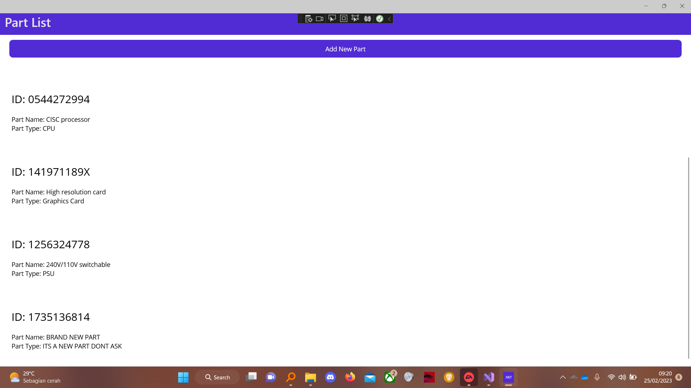
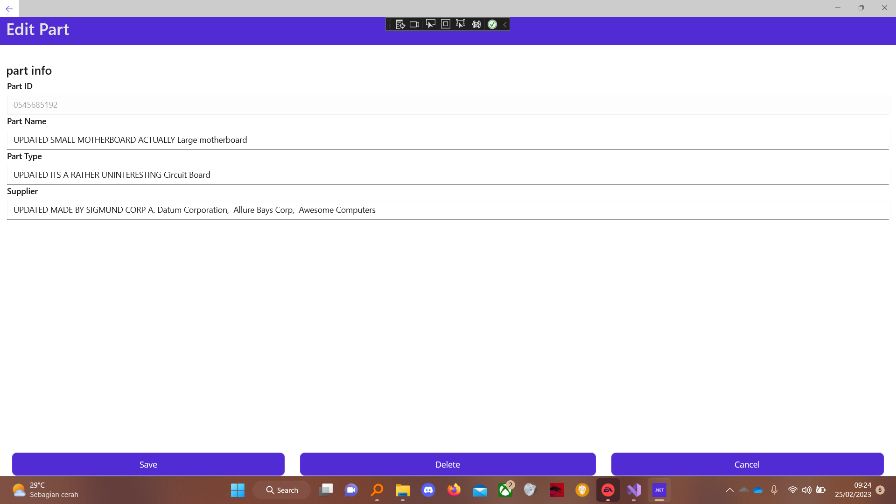
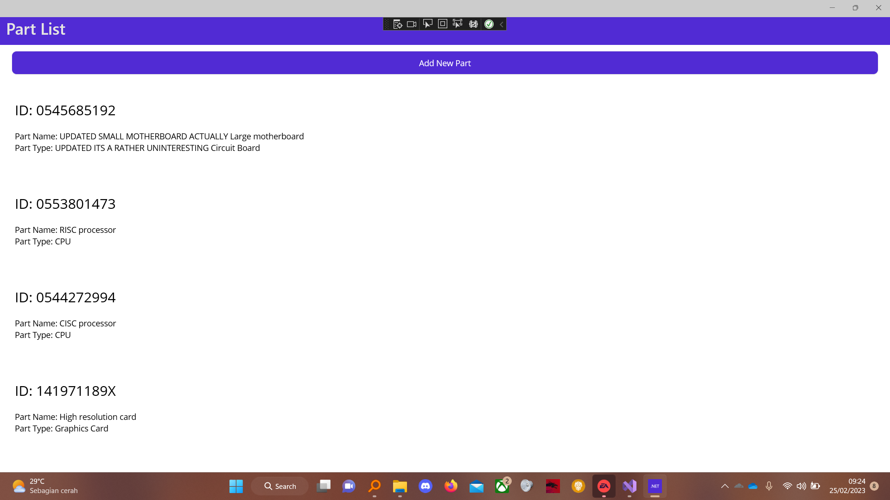
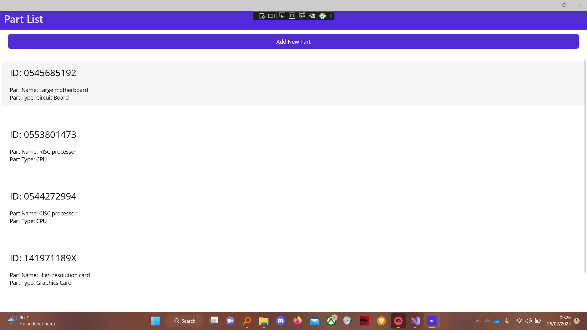

# PartsClient

## Run Program Pertama

## Add Part
### Add Part Menu

### Add Part Result

## Update Part
### Update Part Menu

### Update Part Result

## Delete Part
### Before Deletion

### After Deletion

