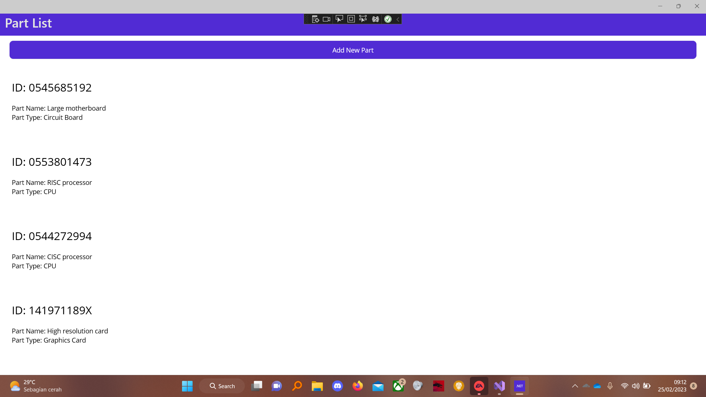
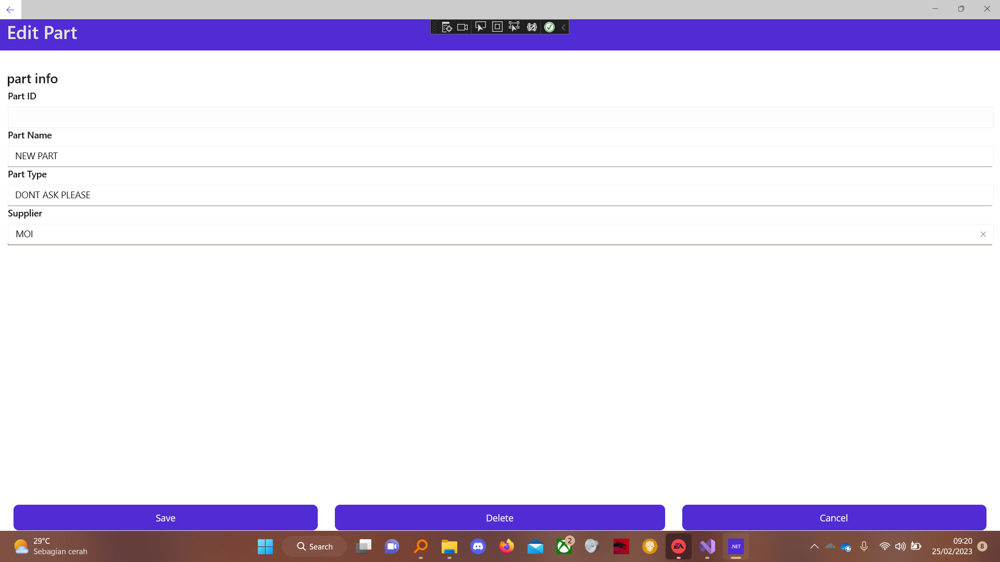
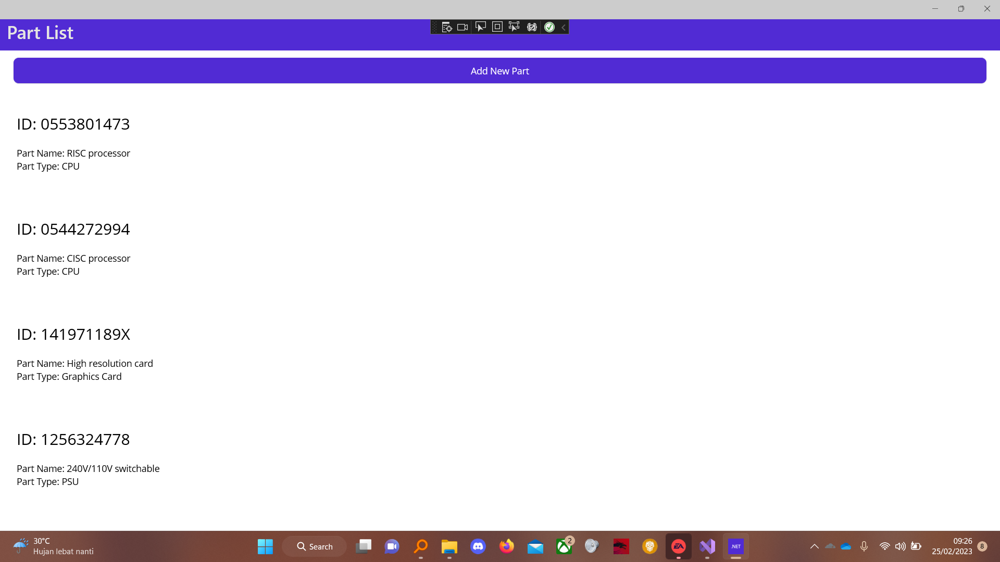

# PartsClient

- [Table of Contents](#partsclient)
  * [Run Program Pertama](#run-program-pertama)
  * [Add Part](#add-part)
    + [Add Part Menu](#add-part-menu)
    + [Add Part Result](#add-part-result)
  * [Update Part](#update-part)
    + [Update Part Menu](#update-part-menu)
    + [Update Part Result](#update-part-result)
  * [Delete Part](#delete-part)
    + [Before Deletion](#before-deletion)
    + [After Deletion](#after-deletion)

## Run Program Pertama

## Add Part
### Add Part Menu

### Add Part Result

## Update Part
### Update Part Menu

### Update Part Result

## Delete Part
### Before Deletion

### After Deletion

